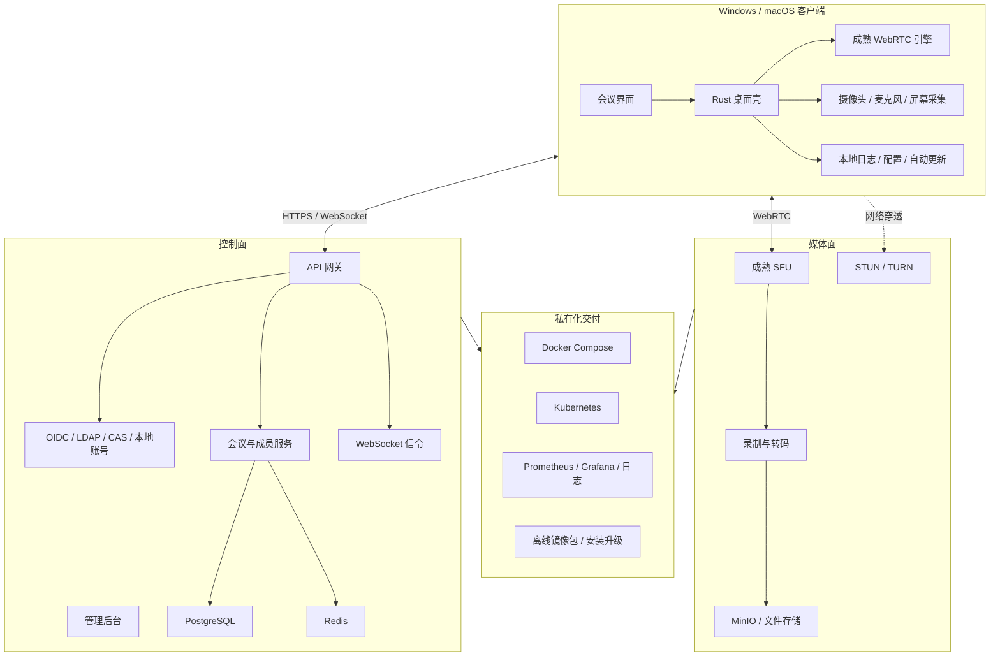

### **整体可行，但不建议把“全栈 Rust + 自研音视频协议栈”作为起点；更适合采用 Rust 桌面壳与控制服务、成熟 WebRTC 媒体内核、私有化部署的一体化方案。**

结合你的能力画像，这个项目与你的后端、物联网、视频接入、部署交付和统一认证能力高度匹配；主要风险集中在桌面端、WebRTC 实时媒体、弱网优化和跨平台兼容性。建议先做面向政企内网的“小而稳”版本，而不是直接挑战通用会议平台。

### **一、你做这件事的匹配度**

你的优势不是“已经精通 Rust 或桌面开发”，而是具备把一套复杂系统真正交付出去的能力。视频会议私有化部署恰好需要后端服务、网络与媒体、认证、部署、安全整改、监控和现场排障共同配合。

| 能力领域 | 匹配度 | 对项目的价值 |
|---|---:|---|
| Java/Go 后端与微服务 | 高 | 会议、用户、权限、录制、管理后台 |
| 视频与流媒体经验 | 高 | 理解信令、媒体服务、带宽和并发瓶颈 |
| Docker/K8s/交付 | 很高 | 一键部署、离线安装、扩容、升级 |
| 统一认证与安全整改 | 很高 | LDAP、OIDC、CAS、等保环境接入 |
| Vue 管理端 | 高 | 管理后台、会议控制台 |
| Rust | 当前偏低 | 需要补语言、异步并发、FFI和桌面生态 |
| PC桌面端 | 当前空白 | 是最明显的新能力区 |
| WebRTC与弱网算法 | 中低 | 是技术难度最高的部分 |

综合判断，你非常适合作为这个产品的**总体架构与工程交付负责人**，并亲自完成控制面、部署体系和部分客户端；但第一阶段不适合独立重写编解码、拥塞控制、回声消除和 SFU 媒体转发内核。

### **二、先校正一个关键预期：Rust 不会自动带来更好的会议体验**

视频会议的体验主要由以下因素决定：

1. 音视频采集和设备兼容性；
2. 回声消除、自动增益和噪声抑制；
3. 网络抖动缓冲、丢包恢复与拥塞控制；
4. SFU 转发策略和上下行码率分配；
5. 屏幕共享质量与帧率控制；
6. 摄像头、麦克风切换及系统权限处理；
7. 客户端崩溃率、安装升级和日志诊断。

Rust 的优势主要是内存安全、并发安全、资源占用可控，以及适合构建本地能力和长期运行的服务。它能改善工程质量和局部性能，但不能替代成熟音视频算法与生态。

因此，“因为 Rust 快，所以会议体验好”并不成立。更准确的产品逻辑应当是：

> 用 Rust 做安全、轻量、可控的桌面客户端和基础服务，用成熟 WebRTC 能力保证音视频体验，用你的部署与交付优势建立私有化竞争力。

### **三、推荐的总体架构**



核心原则是把系统分成三个平面：

- **客户端平面**负责界面、设备调用、本地安全与诊断；
- **控制平面**负责用户、会议、权限和信令；
- **媒体平面**负责音视频转发、穿透、录制和质量控制。

控制面和媒体面必须解耦。会议管理服务挂掉不应立刻打断已经建立的音视频传输；媒体节点扩容也不应要求重构业务系统。

### **四、客户端技术路线**

#### **路线 A：Tauri + Web 前端 + 浏览器 WebRTC**

这是最适合你的第一阶段路线。

- Rust 负责桌面壳、本地配置、日志、文件、托盘、窗口与升级；
- Vue 负责会议 UI，你已有实际经验；
- 音视频先使用 WebView 提供的 WebRTC；
- 管理后台继续使用 Vue；
- Windows 和 macOS 共用大部分业务代码。

优点是开发速度快、Rust 能真正参与、安装包相对轻，而且与你现有能力重合度最高。缺点是 Windows 与 macOS 的 WebView 实现存在差异，设备、编解码器和屏幕共享行为必须分别测试；复杂虚拟背景和深度音频处理也会受到限制。

#### **路线 B：Rust 原生 UI + 原生 WebRTC**

可使用 Rust 原生 GUI，再通过成熟 WebRTC 原生库或 FFI 接入音视频内核。它能提供更一致的原生体验和更强的底层控制，但工程风险显著提高：

- GUI 生态和复杂桌面组件成熟度有限；
- WebRTC 的 C/C++ FFI、线程模型和资源生命周期复杂；
- 摄像头、音频设备、屏幕采集都存在平台差异；
- 签名、公证、权限、崩溃收集和升级系统需要单独建设。

这更适合作为产品验证后，对性能与功能确有明确需求时的第二阶段路线。

#### **路线 C：成熟会议内核二次开发 + Rust 周边能力**

如果你的目标是尽快形成可销售、可交付产品，这条路线商业上最稳：媒体和会议内核采用成熟方案，Rust 用于部署工具、客户端壳、本地服务、诊断程序或边缘代理。

这条路线的“Rust 纯度”最低，但成功概率最高。对你而言，产品价值不应是“用 Rust 写了多少”，而应是“能否在客户内网稳定开会、易于部署、出了问题能定位”。

### **五、媒体服务器不要从零开始写**

多人会议应该使用 **SFU**，不建议采用纯 P2P，也不建议第一版自研 MCU。

| 架构 | 特点 | 适用情况 |
|---|---|---|
| P2P Mesh | 每个客户端向所有人发送媒体 | 仅适合极小会议 |
| SFU | 服务器选择性转发媒体流 | 最适合常规多人会议 |
| MCU | 服务端解码、合成、再编码 | 固定布局、录制或特殊终端场景 |

SFU 的核心价值不是简单“转发 UDP”。它需要处理多路编码、订阅选择、带宽估计、关键帧请求、NACK、RTX、音频活跃检测、网络切换和会话恢复。自研一个能演示的 SFU 不算特别难，但做出生产级质量是长期工作。

第一版建议选用成熟 SFU，并通过内部适配层隔离它：

```text
Meeting Service
      │
Media Orchestrator
      │
SFU Adapter Interface
      ├── Adapter A
      └── Adapter B
```

业务服务不要直接到处调用某个 SFU 的专有 API。这样以后更换媒体内核、做多节点调度或适配国产化环境时，成本会低很多。

### **六、哪些部分值得用 Rust**

不要为了“Rust 应用”强迫所有服务都用 Rust。比较合理的边界如下。

| 模块 | 建议技术 | 原因 |
|---|---|---|
| 桌面壳与本地能力 | Rust + Tauri | 轻量、安全，适合跨平台 |
| 会议 UI | Vue/TypeScript | 你已有能力，迭代快 |
| WebRTC 客户端 | 首版使用成熟 WebRTC | 避免从零解决媒体算法 |
| 用户、会议、权限 | Java 或 Go | 复用你最成熟的工程能力 |
| WebSocket 信令 | Java、Go或Rust | 三者均可，优先交付效率 |
| SFU | 采用成熟产品 | 不把最大风险放在首版 |
| TURN | 成熟 TURN 服务 | 标准基础设施，不应重造 |
| 录制转码 | FFmpeg 管线 | 生态成熟 |
| 部署与诊断工具 | Rust | 能形成轻量单文件工具 |
| 管理后台 | Vue | 复用现有经验 |

若希望通过项目真正提升 Rust，可以把下面几个模块依次 Rust 化：

1. 客户端壳及 IPC；
2. 本地日志和诊断采集器；
3. 自动升级与离线升级工具；
4. WebSocket 信令服务；
5. 媒体节点调度和健康检查；
6. 有明确瓶颈后，再考虑局部媒体组件。

### **七、私有化部署才是你的差异化核心**

通用视频会议市场竞争非常激烈。你更适合把产品定位为：

> 面向政企、园区、城市运行和物联网场景，可在内网或专网独立部署、可集成统一认证和视频设备的安全会议与协同客户端。

这比做另一个大众会议软件更符合你的经历。可以重点构建以下能力：

- Docker Compose 单机版与 Kubernetes 集群版；
- 完全离线安装、升级和回滚；
- 本地账号、LDAP、OIDC、CAS 等认证接入；
- 会议水印、权限控制、操作审计；
- 录制文件本地存储及保留策略；
- 外网、内网、双网卡和受限网络部署；
- 日志脱敏、诊断包和质量报告；
- 私有 CA、国密或国产化适配预留；
- 与 GB28181/RTSP 视频资源联动；
- 管理后台提供并发、带宽、丢包、延迟和节点状态。

最后一项尤其适合你：会议中可以拉入摄像头或城市感知视频，会议结束后形成事件记录。这会使产品从“普通会议客户端”变为“面向城市运行的音视频协同平台”。

### **八、首版 MVP 应严格收缩**

首版目标不是复刻成熟会议软件，而是完成一条稳定闭环：

- Windows 与 macOS 客户端；
- 登录、创建会议、加入会议；
- 2～9 人音视频；
- 麦克风、摄像头和扬声器切换；
- 屏幕共享；
- 主持人静音与成员管理；
- 文本聊天；
- 单机私有化部署；
- 基础会议记录与操作审计；
- 客户端和服务端诊断日志；
- 弱网指标显示。

首版暂时不要做：

- 自研 SFU；
- 自研编解码器；
- 虚拟背景和复杂美颜；
- 大规模网络研讨会；
- 电话网接入；
- AI 同传和实时字幕；
- 端到端加密的复杂密钥体系；
- 移动端与桌面端同时开发；
- 复杂白板和在线文档。

录制功能也可以放到第二个里程碑。录制会引入合流、转码、音画同步、文件管理和磁盘容量控制，很容易拖慢 MVP。

### **九、建议的实施阶段**

#### **阶段 0：技术验证，2～4 周**

目标是验证最危险的部分，而不是先写完整业务系统。

需要完成：

1. Tauri 在 Windows 与 macOS 上调用摄像头、麦克风；
2. 两台机器跨网络建立 WebRTC 连接；
3. 连接 SFU 完成 4 人会议；
4. 两个平台完成屏幕共享；
5. 验证设备热插拔、切换和权限拒绝后的恢复；
6. 验证公司内网、防火墙和 TURN 场景；
7. 输出 CPU、内存、延迟、丢包和温升数据。

若 Tauri WebView 在关键设备兼容性上持续出现不可控问题，就应及时切换到原生 WebRTC 路线，而不是在 UI 层反复修补。

#### **阶段 1：内部可用版，6～10 周**

完成登录、会议生命周期、成员控制、信令、基础管理后台、Compose 部署和日志诊断。目标是让团队真实开会，并持续记录问题。

#### **阶段 2：私有化交付版，8～12 周**

重点不是添加花哨功能，而是补齐：

- 安装、升级、备份和恢复；
- LDAP/OIDC/CAS；
- HTTPS 与私有证书；
- 审计、权限和安全基线；
- 录制与存储策略；
- 媒体节点监控；
- 离线部署包；
- Windows 签名与 macOS 签名、公证；
- 兼容性测试矩阵。

#### **阶段 3：形成行业差异化**

把你已有的 IoT 与视频能力引入产品，例如：

- 会议内调取 GB28181 或 RTSP 视频；
- 现场人员与固定摄像头同时入会；
- 告警事件一键发起会议；
- 会议与工单、事件、设备关联；
- AI 会议纪要作为可选能力；
- MCP 接入设备、知识库和业务系统。

### **十、必须提前验证的主要风险**

#### **跨平台设备兼容**

摄像头能打开不等于稳定可用。需要覆盖集成摄像头、USB 摄像头、蓝牙耳机、USB 声卡、多个屏幕、睡眠唤醒、热插拔和系统默认设备变化。

#### **macOS 权限和分发**

摄像头、麦克风、屏幕录制权限涉及不同授权流程。正式交付还需要处理应用签名、公证、权限描述、升级包签名和企业内部分发。

#### **Windows 音频与屏幕共享**

需要测试 WASAPI 设备切换、系统声音采集、DPI 缩放、多显示器、显卡差异，以及摄像头被其他程序占用等情况。

#### **NAT、防火墙和专网**

私有化客户的网络往往比公网更复杂。必须支持 TURN over UDP/TCP/TLS，并明确内外网地址映射、端口范围和反向代理边界。很多“客户端体验问题”实际上是部署网络问题。

#### **带宽与容量**

SFU 不做完整转码，但出口带宽仍会快速增长。容量模型至少要考虑：

$$
B_{out} \approx N \times (N-1) \times b
$$

其中 $N$ 是会议人数，$b$ 是每路平均媒体码率。实际系统可通过分层编码、只订阅可见画面、活跃发言人模式和大小流降低带宽，但不能忽略出口带宽成本。

#### **授权与许可证**

选择 SFU、客户端库、编解码器、录制组件时，要在技术验证阶段完成许可证审查。私有化商业交付与内部学习的授权风险完全不同。

### **十一、你最合理的个人分工**

你可以亲自主导：

- 产品边界与整体架构；
- 会议控制面、认证和权限；
- Rust/Tauri 客户端壳；
- Vue 会议 UI 与管理后台；
- Compose/K8s 私有化部署；
- 可观测性、诊断与安全整改；
- 摄像头资源和 IoT 平台集成。

最好引入或专项补齐的能力包括：

- 熟悉 WebRTC 的实时音视频工程师；
- Windows/macOS 原生多媒体与发布经验；
- 音频算法和弱网质量调优；
- 跨平台自动化兼容测试。

如果完全个人开发，第一版应把目标控制在小会议、单 SFU、单机部署和基础屏幕共享，否则很容易长期停留在“功能很多，但没有一场会议真正稳定”的状态。

### **十二、最终建议**

这个方向值得做，但建议调整成如下命题：

> 做一个由 Rust 驱动客户端与部署工具、基于成熟 WebRTC/SFU、面向政企内网私有化交付，并可融合物联网视频资源的桌面会议系统。

推荐起步组合是：

- 客户端：Tauri + Rust + Vue；
- 音视频：WebRTC；
- 媒体层：成熟 SFU；
- 穿透：成熟 STUN/TURN；
- 控制面：沿用你熟悉的 Java 或 Go；
- 数据层：PostgreSQL + Redis；
- 录制：后续接入 FFmpeg 与对象存储；
- 部署：先 Docker Compose，再 Kubernetes；
- 监控：Prometheus + Grafana + 日志系统。

这个项目对你真正有价值的地方，不只是学会 Rust，而是补上“跨平台 PC 客户端”这块能力，同时把已有的后端、视频、认证、运维、政务交付和 AI 工程能力收束成一个完整产品。成败关键不是 Rust 写得多快，而是首版是否足够克制，以及是否尽早用真实设备、真实网络和真实会议进行验证。