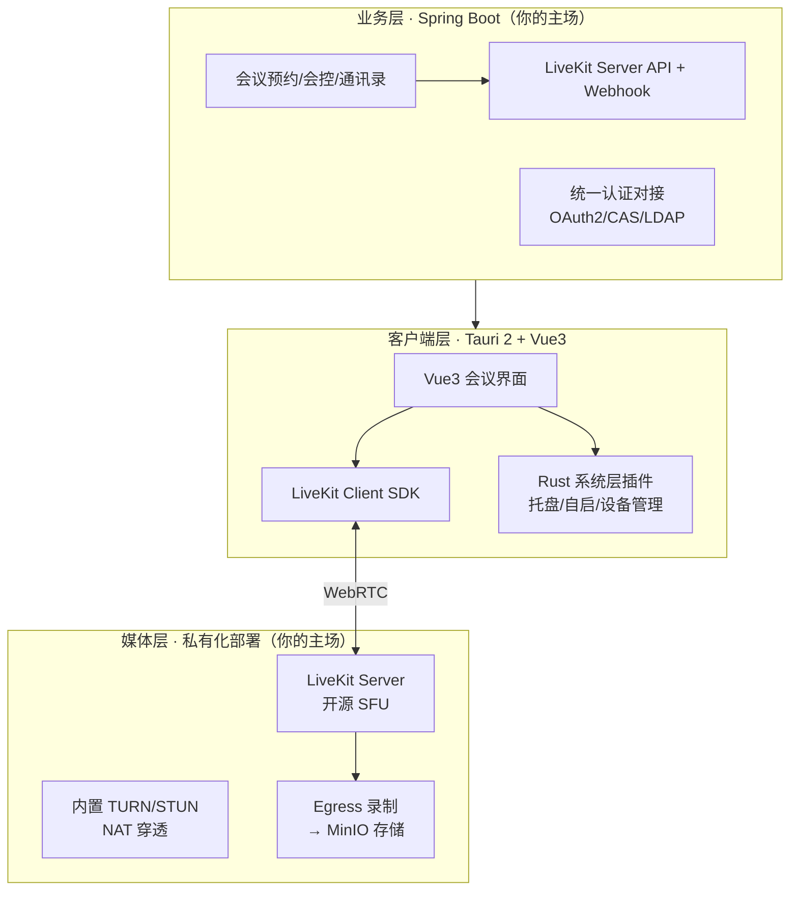

### **结论：方向可行，但要换个打法——别用 Rust 从零造视频会议，而是用「Rust 壳 + 成熟开源 SFU 芯」，把你最弱的"桌面端"外包给 Tauri，把你最强的"私有化交付"做成卖点。**

你的画像里藏着两个关键事实需要先点破：**Rust 和 PC 桌面端恰好是你的双空白区**（画像明确写着"桌面端 PC 软件仍是空白"，Rust 通篇未出现），而视频会议恰好是软件工程里复杂度最高的一类应用。所以这件事的可行性不取决于 Rust 火不火，而取决于你怎么拆分"自己造的"和"站在巨人肩膀上的"。下面展开讲。

#### **一、先校正三个认知偏差**

**1. "Rust 所以快"——对视频会议只成立一小半。** 视频会议的性能瓶颈在三个地方：编解码（H.264/AV1 硬件编解码）、网络转发（SFU 的路由效率）、回声消除（DSP 算法）。这三件事的底层实现几乎都是 Google libwebrtc（C++），跟你的应用壳用 Rust 还是 Node.js 写几乎没有关系。Tauri（Rust）相对 Electron（Node）的真实优势是：内存占用约 60\~100MB 对 300MB+、安装包约 10MB 对 200MB、启动更快 [CSDN](https://aiot.csdn.net/69df64220a2f6a37c5a02482.html)。也就是说 Rust 让"壳"更轻，但会议卡不卡，取决于 SFU 选型和编解码策略。把"快"的期望放对位置，能避免你在错误的地方较劲。

**2. 你现有的视频经验是"安防视频"，不是"视频会议"。** 你的 WVP-GB28181 + ZLMediaKit 体系解决的是**摄像头→服务器→观看端**的单向分发，延迟容忍 3\~5 秒，协议栈是 GB28181/RTSP/RTMP/HLS。视频会议是**多方实时互动**，延迟要求 300ms 以内，协议栈是 WebRTC（ICE/DTLS/SRTP/Simulcast），还要处理回声消除、带宽估计、抖动缓冲——这是另一个技术世界。你的流媒体运维功底（媒体服务器部署、转码、分发）可以迁移，但核心协议栈要从零学。这个认知很重要，否则你会低估学习成本。

**3. 但有一个交叉点是你的金矿**，后面差异化部分细说。

#### **二、能力匹配度盘点**

| 项目所需能力 | 你的现状 | 缺口评估 |
|------|------|------|
| 私有化部署交付（Docker/K8s） | 9 分，画像里的主场 | 无缺口，反而是卖点 |
| 业务服务端（房间/会控/认证） | Java 9 分 + 统一认证 8.5 分 | 无缺口 |
| 会议界面 UI | Vue 6.5 分，有自有提交 | 够用 |
| 流媒体服务器运维调优 | ZLMediaKit 实战 | 需迁移到 WebRTC 系 |
| WebRTC 协议与 SFU | 零基础 | 大缺口，但可绕过（见下） |
| Rust 语言 | 未出现在画像中 | 中缺口，1\~3 个月学习期 |
| PC 桌面端工程化 | 画像自认空白 | 中缺口，Tauri 可大幅降门槛 |

关键洞察是：**"WebRTC 协议栈"这个最大缺口恰恰是最不该自己填的**。2026 年的今天，开源 SFU 已经非常成熟，自己写 WebRTC 服务器是以年为单位的无谓牺牲。

#### **三、推荐技术方案**

##### **整体架构：三层分离**

**媒体层选 LiveKit，理由很硬：** 它是目前开源 WebRTC SFU 里生态最完整的，官方明确定位私有化部署场景，提供 Go 实现的服务端（Docker 一键起）、全平台客户端 SDK、开源会议样板 Meet，还有专门的 Egress 录制组件 [LiveKit 中文站](https://livekit.net.cn/use-cases/video-conferencing) [掘金](https://juejin.cn/post/7271974618565705785)。备选 mediasoup（更灵活但拼装量大）和 Jitsi（开箱即用但定制和信创裁剪都重），对你"一个人+要产品化"的场景都不如 LiveKit 合适。

**客户端选 Tauri 2 + Vue3，这是方案里最妙的一步：** Tauri 2.0 稳定版已发布，支持 Windows/macOS/Linux，前端可以用任何主流框架 [开源中国](https://www.oschina.net/news/315100/tauri-2-0-stable)。这意味着你画像里 6.5 分的 Vue 能力直接复用写会议界面，Rust 只负责系统层（托盘、开机自启、自动更新、本地设备管理）——**Rust 学习成本和桌面端空白这两个缺口被同时压缩到最小**。音视频通信用 LiveKit 官方 JS SDK，绕开 WebRTC 细节。

这里有两条 Rust 含量不同的路线，务必选第一条：

| 路线 | 做法 | Rust 含量 | 风险 |
|------|------|------|------|
| **A. 轻 Rust（推荐）** | Tauri 壳 + Vue 界面 + LiveKit JS SDK，Rust 只做系统插件 | ~15% | 低，2\~3 个月出 MVP |
| B. 重 Rust | LiveKit 官方 Rust SDK + 原生 GUI（egui/Slint）自绘视频 | ~80% | 高，视频渲染管线要自建，开发量 3\~5 倍 |

LiveKit 确实有官方 Rust SDK，且被官方定位为其他平台 SDK 的共同核心 [GitHub](https://github.com/livekit/rust-sdks)，但它更适合作为二期"深优化"的储备，不适合 MVP。先用路线 A 把产品跑起来，Rust 功底是在真实项目里长出来的，不是先学完再动手。

**服务端是你彻底的主场：** 会议预约、会议室管理、主持人会控、企业通讯录——全部是 Spring Boot CRUD + WebSocket 推送，通过 LiveKit 的 Server API 和 Webhook 与媒体层联动。统一认证直接复用你公共组件里的 oauth2/usercenter 那套，对接客户的 LDAP/AD，这在政企私有化场景是刚需中的刚需。部署侧 docker-compose 起步、K8s 清单备着大客户——这正是你画像里 9 分的部分。

#### **四、差异化：别做"另一个腾讯会议"，做"能接入监控摄像头的会议"**

正面刚腾讯会议/华为云会议的私有化版本没有胜算。但你画像里有个别人很难复制的组合：**视频会议 + GB28181 安防视频 + 政务交付 + 信创经验**。把 WVP/ZLMediaKit 里的摄像头流转推（RTMP/RTC）注入 LiveKit 房间，就是"指挥调度会商系统"——应急、城管、水利（正好是你项目域覆盖里的行业）开会时能直接把现场监控画面拉进会议。这个场景市面上产品很少，而你有全链路经验。再叠加信创适配（你有 x86→ARM 迁移实战），在政企内网市场是一个真实可打的定位。

#### **五、路线图与风险**

**MVP 路径（约 3 个月）：** 第 0 阶段（2\~4 周）学 Rust 基础 + 跑通 Tauri 官方示例 + 用 LiveKit Cloud 免费额度打通一个网页版会议 demo；第 1 阶段（4\~6 周）docker-compose 私有化部署 LiveKit，Tauri+Vue 实现最小会议（入退房、音视频开关、屏幕共享、文字聊天）；第 2 阶段接 Spring Boot 业务层和认证，加 Egress 录制；第 3 阶段做差异化功能（摄像头入会）和工程打磨（自动更新、崩溃上报、双平台签名打包）。

**必须提前知道的风险：**

1. **老旧内网环境是 Tauri 的软肋。** Tauri 依赖系统 WebView——Windows 上是 WebView2（Chromium 内核，Win10+ 才有），macOS 上是 WebKit [掘金](https://juejin.cn/post/7543917534355636243)。私有化政企客户现场可能存在 Win7 或无外网的阉割环境，那里 WebView2 不可用；如果你的目标客户环境老旧，Electron（自带 Chromium、兼容性极强）反而是更稳的选择，代价是包体积和内存。这个决策要在写第一行代码前根据目标客户环境定死。
2. **音视频设备兼容性是桌面端永恒的泥潭。** 摄像头/麦克风枚举异常、蓝牙耳机切换、屏幕共享权限（macOS 尤其繁琐），这部分工作量不比界面开发小，预留缓冲。
3. **单人产品的持续性。** MVP 可行，但"可交付的产品"（含运维文档、升级方案、漏洞响应）是长期投入——好在这恰好是你画像里"交付文档闭环"的强项。

总结一句：这件事对你不是"学 Rust 顺便做个软件"，而是"用最小 Rust 成本把私有化会议产品跑起来，再用你的政务+安防+交付组合拳建立护城河"。先花一个月把 Rust 和 LiveKit demo 啃下来，如果 demo 阶段就感觉工程量失控，退回 Electron + LiveKit 依然是完全成立的产品方案。