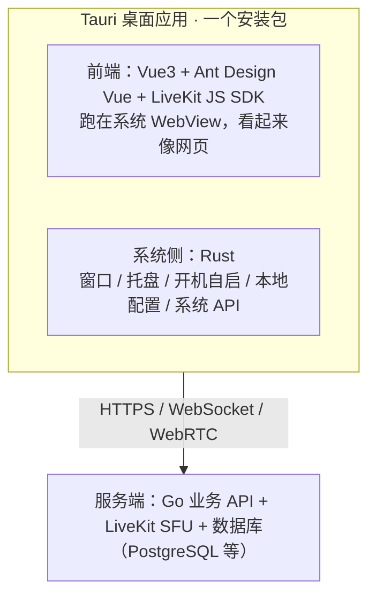
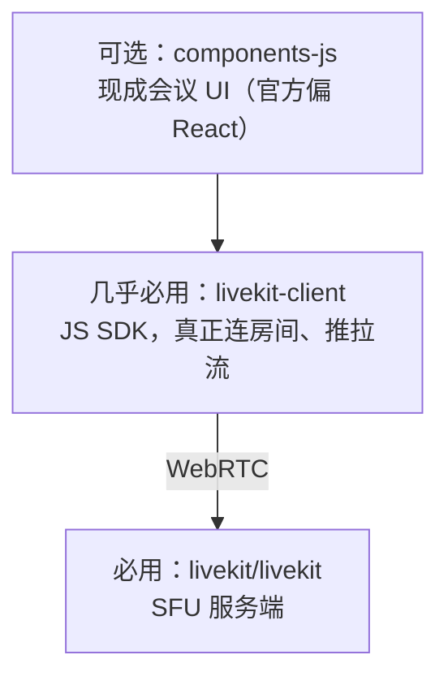

# 第一次思考

同时问了4个LLM以下问题：
根据我的[[能力画像]]，分析下我现在要做的事： 我现在想做一个rust应用，因为rust语言现在比较火爆，做出来的软件速度很快，体验会很好。我在考虑做一个PC客户端，跨windows和mac。 我想做的软件是私有化部署的视频会议。 分析下可行性和方案。

他们有不同回答：
[[Claude-Opus-4.8]] · [[GPT-5.6 Sol]] · [[Kimi-k3]] · [[Qwen3.8-Max-Preview]]

下面是自己消化后，跟 Cursor 的问答。

---

## 学习

**我：** 之前这4个对我的能力画像还是有些误解。我不认为一定要把 Rust 完全学会——我是新时代 AI 工程师，大概学一下特点、能做什么、配置怎么写、怎么启动就行，具体改代码由 AI 改即可。

**Cursor：** MVP 可以这么干，但有个底线：出问题要能看懂日志、分清是壳崩了还是媒体挂了。不必学成 Rust 专家，但要能分清责任边界。

### rust、Tauri

**我：** Rust 和 Tauri 分别是什么？一个语言一个框架？框架为什么能包 Vue？Rust 是前端还是后端？我理解那几个 LLM 是让我用 Rust 写 PC 客户端的壳——其实我本来就是这个意思。我说的「快」指的是操作流畅，不是视频流畅，他们误解了。

也就是说：客户端用 Tauri，前端 Vue3，后端 Rust，对吗？前端 Vue3 的话，也能用 Ant Design Vue 这类组件库吧？

**Cursor：** 对。更准确说：**一个 Tauri 桌面应用 = Vue3（前端）+ Rust（系统侧）打成一个安装包**，不是「壳里只有 Rust、Vue 在外面」。



| 在哪 | 技术 | 干什么 |
|---|---|---|
| **Tauri 应用内 · 前端** | Vue3（可用 Ant Design Vue）+ LiveKit JS SDK | 会议界面；进房、推流、拉流 |
| **Tauri 应用内 · 系统侧** | Rust | 窗口、托盘、开机自启、本地文件/配置 |
| **服务端（不在 Tauri 里）** | Go + LiveKit SFU + PostgreSQL 等 | 房间、Token、用户、录制元数据；媒体转发 |

**数据库一般不放进 Tauri。** 会议房间、用户这些走服务端库；客户端最多本地存一下登录态、偏好设置（文件或本地 SQLite 都行），那不是业务主库。

Tauri 不是「用 Rust 做视频会议」——**Rust 不负责会议卡不卡**，只让壳更轻。「快」若指启动/内存/操作流畅 → Tauri 对；若指望视频更流畅 → 那是 WebRTC / SFU 的事。

**我：** 「Tauri 应用内 · 音视频」是指 Rust 这个后端要用 LiveKit SDK 去连服务端的 LiveKit 吗？

**Cursor：** **不是。** MVP 路线里，连 LiveKit 的是 **Vue 前端里的 LiveKit JS SDK**，不是 Rust。

- **Vue + LiveKit JS SDK**：进房、推麦/摄像头、拉别人的流、开关设备
- **Rust**：不管 LiveKit；只管窗口、托盘、自启、本地配置
- **服务端 LiveKit**：真正的 SFU，收流转发

所以之前表格单独写一行「Tauri 应用内 · 音视频」容易误导——已改成并进「前端」那一行。Rust 侧默认不装 LiveKit SDK。LiveKit 也有官方 Rust SDK，那是「重 Rust」路线，MVP 不走。

### WebRTC

**我：** WebRTC 是啥？第三次能力分享时学过，感觉是个播放协议。为什么要单独拿出来讲？整个视频会议不就是都用 WebRTC 吗？还有别的意思吗？

**Cursor：** 不只是「播放协议」，更准确是：**浏览器/客户端之间实时传音视频的一整套标准**（采集、编码、加密、NAT 穿透、丢包恢复……）。

[[第三次分享：摄像头接入能力]] 里 ZLMediaKit 那套是「摄像头 → 服务器 → 人看」，延迟秒级可接受；会议是「多人互相说话」，延迟要压到几百毫秒。所以不是「整个项目只用一个播放协议」，而是：

- **会议互动**：WebRTC
- **安防摄像头入会（二期）**：GB28181 / RTSP → 转成 WebRTC 房间流

### SFU

**我：** 一直在说 SFU，这是什么？网关？用来转发所有视频源给其他人？粘合剂？

**Cursor：** 不是网关，更像**媒体交换机**：你说话 → 发给 SFU → SFU 转发给其他人。不混成一路大视频（那叫 MCU）。没有 SFU，N 人会议就要每人直连每人，带宽爆炸。LiveKit 本质上就是带好生态的 SFU + 房间 API。

### LiveKit

**我：** LiveKit 跟第三次分享里的 ZLMediaKit 差不多吧？可能更适合做视频会议？

**Cursor：** 同类不同场景：

- ZLM：推拉流、录像、安防分发
- LiveKit：房间、轨（音/视/屏）、权限、录制、SDK

第一期用 LiveKit 对；ZLM 留到「监控入会」再接。

---

## 目标

**我：** 第一版其实不用关心业务、系统、登录，只要功能能跑；其他东西以后往上缝或重做。需要管理后台吗？整个项目不能只做 PC 客户端吧？

**Cursor：** 「只要功能」同意，而且可以更狠——第一版甚至**先别做 Tauri**：

1. `docker compose` 起 LiveKit
2. 浏览器打开官方 Meet / 极简 Vue 页
3. 验证：进房、开关麦、摄像头、屏幕共享

壳第二步再套。先证明媒体面能跑。

管理后台：

- MVP：**不要**，房间用 LiveKit API / Token 临时创建即可
- 产品化：要（预约、成员、录制、私有化配置）

架构上客户端只是入口之一：

```
客户端(Tauri/Web)  →  业务API(Go)  →  LiveKit(SFU)
```

先有媒体 + 最小业务，客户端后补；反着先抠桌面壳容易空转。

---

## 想法

**我：** 管理后台必然用 Go——air 热加载适合 Agent 改代码，编译也比 Java 快。不关心部署，本机先跑起来就行。要站在巨人肩膀上，不从零手搓；有没有好的 MIT 开源视频会议项目？Kimi 说的安防摄像头接入会议不错，后期做，第一期不做。成品亮点除了会议+监控同屏，还有私有化、自主可控、可嵌入，以及解除腾讯会议那种 60 分钟 VIP 限制。

**Cursor：** 后台用 Go 完全合理，别和媒体层绑死。亮点别硬刚「功能比腾讯多」，真正可打的是：

1. 私有化 / 自主可控 / 可嵌入
2. 无 60 分钟等 VIP 卡点
3. 二期：会议 + GB28181 监控同屏

开源优先 Apache / MIT：

| 项目 | 角色 | 建议 |
|---|---|---|
| [LiveKit](https://github.com/livekit/livekit) | SFU + Server | 媒体层首选 |
| [livekit/components](https://github.com/livekit/components-js) | 会议 UI 组件 | 少写界面 |
| Jitsi | 整包会议 | 定制重、不如 LiveKit 好嵌 |
| mediasoup | 更底层 SFU | 拼装量大，一人产品不推荐 |

不必搓 SFU；价值在交付、认证、嵌入、安防融合。

**我：** 上面 LiveKit 和 livekit/components 有什么区别？Apache-2.0 虽然不如 MIT，但商用我觉得也没问题吧？

**Cursor：** 两个不是竞品，是上下游：

| | [livekit/livekit](https://github.com/livekit/livekit) | [livekit/components-js](https://github.com/livekit/components-js) |
|---|---|---|
| 是什么 | **服务端**：SFU 媒体服务（你要 docker 起来的那个） | **前端**：现成的会议 UI 积木（画面格子、静音按钮、设备选择等） |
| 跑在哪 | 服务器 | 浏览器 / Tauri 里的 WebView |
| 你缺了谁 | 没有它 → 没法开会 | 没有它 → 也能开会，但界面要自己用 `livekit-client` SDK 拼 |

关系可以记成：LiveKit Server 传音视频；Components 是套在 Client SDK 上的 UI 层，少写界面。

注意：官方 Components 主推 **React**。你定 Vue3 的话，这条「少写界面」红利打折——多半直接用 [`livekit-client`](https://github.com/livekit/client-sdk-js)（JS SDK）自己做 Vue 组件，或找社区 Vue 封装；Components 仓库当参考实现看即可。

**协议：** Apache-2.0 商用完全可以，私有化闭源产品也常见。和 MIT 实际差别主要是：

- 要保留版权 / LICENSE / NOTICE
- 有专利授权条款（对商用其实是好事）
- 改了开源文件再分发时要注明修改

**不要求**你把自家业务代码开源。对你这种嵌入政企产品的场景，Apache-2.0 和 MIT 在「能不能卖、能不能闭源」上没有实质障碍；之前写「优先 MIT」不必卡死，**Apache-2.0 够用**。

**我：** 那这两个不就是一个前端一个后端？合在一起才是完整的 LiveKit？

**Cursor：** **方向对，但「前端」别理解成只有 components。** 更完整是三层：



| 层 | 仓库/东西 | 算不算「完整会议」必需 |
|---|---|---|
| 服务端 | `livekit/livekit` | **必需** |
| 客户端 SDK | `livekit-client`（client-sdk-js） | **必需**（浏览器/Tauri 里调它） |
| UI 组件 | `components-js` | **可选**（没有就自己用 Vue 画按钮） |

所以：

- 「Server + 某种前端」才能开起会 → **对**
- 「Server + components 两个仓库 = 完整 LiveKit」→ **差不多，但不精确**；精确说是 **Server + Client SDK**，components 只是套在 SDK 上的 UI 糖
- 你还要自己有一块：**发 Token 的业务 API**（Go），否则客户端没凭证进不了房——这不属于 LiveKit 仓库，是你的产品层

你 Vue 路线可以记成：**LiveKit Server（后端媒体）+ livekit-client（前端连接）+ 自己的 Vue 界面**；components 可参考、可不绑。

**我：** 我理解 components 是 server 对应的 web 管理页面？

**Cursor：** **不是。** components 是**开会客户端里的 UI 积木**（画面格子、静音、摄像头切换、屏幕共享按钮……），给「进会议室的人」用的，不是给「运维/管理员」用的后台。

| 东西 | 给谁用 | 干什么 |
|---|---|---|
| `components-js` | 会议参与者 | 会议室里的界面组件 |
| LiveKit Server API / CLI | 你的后端或运维 | 建房、踢人、查房间…… |
| 你以后自己写的 Go/Vue 管理后台 | 管理员 | 预约会议、用户权限、录制列表等 |

LiveKit 开源版**没有**一个开箱即用的「Server 配套管理站」就叫 components。管理能力要靠 Server API，管理页面要你自己做（产品化阶段再做）。

笔记里有个张力：想做 Tauri PC 客户端，又想第一版只要功能。建议顺序：

1. LiveKit 私有化 + 浏览器进房（验证 WebRTC / SFU）
2. 薄 Go API（创建房间、发 Token，可无登录）
3. Vue 会议页打磨 → 套 Tauri 壳
4. 管理后台、认证、录制、监控入会

Rust 压到第 3 步再碰，和「AI 工程师 + 少学语言」一致。

---

## 待继续聊

- A. 第一版最小功能清单（做到哪算「能开会」）
- B. LiveKit 本机怎么起、房间 / Token 怎么理解
- C. 要不要上 Tauri，还是先 Web
- D. MIT 开源项目再筛一版，可贴仓库清单
