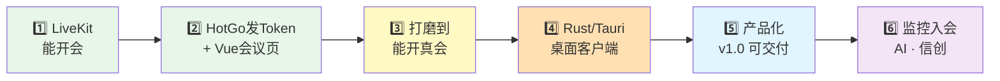

# 学习和实现路线

> 承接 [[第一次问询]] 的结论，回答其中「待继续聊」的 A/B/C/D。
> 这是一份**活文档**：每完成一个阶段回来打勾、修正预估。

---

## 0. 路线设计的四个前提

这条路线是按你的 [[能力画像]] 定制的，不是通用教程：

1. **你的学法**：概念、架构、配置、日志自己懂；代码让 Agent 写，你负责提需求、验收、出问题时分清「壳崩了还是媒体挂了」。每阶段都区分「你要亲自懂的」和「扔给 AI 的」。
2. **先媒体后业务，先 Web 后壳**：会议能不能跑取决于 LiveKit（SFU），不取决于 Rust。Rust/Tauri 压到阶段 4 才碰，符合第一次问询的结论。
3. **每阶段有硬性验收**：达不到就不进下一阶段，防止「什么都摸了一下、什么都没跑通」。
4. **主场优势后置引爆**：私有化交付（Docker/K8s）、Go 业务层、GB28181 安防是你的主场，放在阶段 5/6 收割，前期不分心。

### 不做清单（防跑偏，随时回来看）

- ❌ 自研 SFU、改 LiveKit 源码——价值在交付和融合，不在造轮子
- ❌ 第一天上 Tauri / 学 Rust
- ❌ MVP 阶段做登录、预约、管理后台
- ❌ 对标腾讯会议功能列表——卖点是私有化、可嵌入、无 60 分钟卡点、监控入会
- ❌ 重 Rust 路线（LiveKit Rust SDK + 原生自绘 UI）——留作二期可选优化
- ❌ 一开始纠结 K8s / 高可用——docker compose 够用到阶段 5

---


## 1. 路线总览

> 时间按**业余投入每周 10~15 小时**估算，全职可对半砍。


| 阶段    | 主题                    | 预估    | 交付物（里程碑）                    | 新学的东西                             |
| ----- | --------------------- | ----- | --------------------------- | --------------------------------- |
| **1** | LiveKit 直接开起会         | 1~2 周 | 局域网两台设备互相开会                 | WebRTC/SFU 概念落地、LiveKit 配置与日志     |
| **2** | HotGo addon 发 Token + 独立 Vue 会议页 | 2 周   | 从自己的页面输昵称就能开会               | HotGo 插件、Token 机制、livekit-client 事件模型 |
| **3** | 会议体验打磨（仍是 Web）        | 2~3 周 | 拉真人开一次 30 分钟会议              | 会控、数据通道、布局、弱网表现                   |
| **4** | Rust 速成 + Tauri 套壳    | 3~4 周 | Win + Mac 安装包，装完能开会         | Rust 读懂级、Tauri 工程与系统权限            |
| **5** | 产品化最小集                | 3~4 周 | 可交付的 v1.0：一键部署包 + 录制 + 管理后台 | Egress 录制链路（其余全是你主场）              |
| **6** | 差异化二期                 | 另计    | 监控入会 / AI 纪要 / 信创           | Ingress、GB28181 转推、LiveKit Agents |


累计到 v1.0 约 **3~4 个月**，与 Kimi 的估算一致。




---


## 2. 阶段 1：LiveKit 直接开起会（1~2 周）

> 对应「待继续聊 B：LiveKit 本机怎么起、房间/Token 怎么理解」。
> **本阶段几乎不写代码**，目的是证明媒体面能跑 + 把概念焊在真实系统上。


### 做什么

1. 启动 LiveKit（本机 mac 推荐 **brew 原生跑**，别用 Docker 桥接）：

```bash
# 推荐：原生安装（媒体地址就是本机，WebRTC 稳）
brew install livekit
livekit-server --dev
```

   另开一个终端窗口保持这个进程别关。看到日志里 `starting LiveKit server` / 监听 `7880` 即可。

   > 若坚持用 Docker（后期 compose 部署再练），mac 上 Docker Desktop **不能**指望 `--network host`。至少要让服务对外宣称 `127.0.0.1`，否则会把 Docker 内网 IP（如 `172.17.0.2`）当 ICE 候选发给浏览器，表现为：**信令进房成功 → 几秒后 Disconnected**。临时可用：
   >
   > ```bash
   > docker stop $(docker ps -q --filter ancestor=livekit/livekit-server) 2>/dev/null
   > docker run --rm -p 7880:7880 -p 7881:7881 -p 7882:7882/udp \
   >   -e LIVEKIT_CONFIG='
   > port: 7880
   > rtc:
   >   tcp_port: 7881
   >   udp_port: 7882
   >   use_external_ip: false
   >   node_ip: 127.0.0.1
   > keys:
   >   devkey: secret
   > ' livekit/livekit-server --bind 0.0.0.0
   > ```
   >
   > 阶段 1 优先 brew 原生；Docker 留给阶段 5 写交付包时再抠。

   `--dev` / 上面 config 的密钥对：API Key = `devkey`，Secret = `secret`。

2. 安装官方 CLI（命令名是 `lk`）：

```bash
# macOS（你这台机器）
brew install livekit-cli

# 装完自检
lk --version
```

   其他平台备选：Linux 用 [官方文档](https://docs.livekit.io/reference/developer-tools/livekit-cli/) 的 curl 安装脚本；或直接下 [GitHub Releases](https://github.com/livekit/livekit-cli/releases/latest) 的预编译二进制。

3. 手动生成一个进房 Token：

```bash
lk token create --api-key devkey --api-secret secret \
  --join --room demo --identity zhangsan --valid-for 24h
```

| 参数 | 作用 |
|---|---|
| `lk token create` | 用 CLI 签一张进房用的 JWT（正式产品里这步由你的 Go API 做，阶段 1 先手动签） |
| `--api-key devkey` | 服务器认的 API Key。`--dev` 模式固定是 `devkey`，必须和 LiveKit 服务端配置一致，否则验签失败进不了房 |
| `--api-secret secret` | 和 Key 配对的密钥，用来**签名** Token。只该出现在服务端/CLI，**永远不要写进前端页面** |
| `--join` | 快捷开关：自动带上「允许加入房间」等常用视频权限（等价于给 Token 塞好 `roomJoin` 一类 grant） |
| `--room demo` | 这张 Token **只能进名为 `demo` 的房间**。房间名是字符串，不存在会在有人进时自动创建 |
| `--identity zhangsan` | 参与者身份 ID，房间内必须唯一。第二个窗口要换 `lisi` 等，**两人不能共用同一个 identity**（后进会顶掉先进） |
| `--valid-for 24h` | Token 有效期。过期后即使用这串字符串也会被拒，需重新签发 |

   终端会打印一长串 JWT，复制下来下一步用。可选：`--name 张三` 设置显示名（不写则常默认等于 identity）。若加 `--open meet`，会顺带打开官方 Meet 页（连的是云端演示，本机自建服务请别用这招）。

4. **先在本机用官方 Meet 页进房**（不必本地跑 meet）：
   1. 浏览器打开 [meet.livekit.io](https://meet.livekit.io)
   2. 选 **Custom**（不要用 LiveKit Cloud 那套默认）
   3. LiveKit URL 填：`ws://localhost:7880`
   4. Token 粘贴上一步生成的整串 JWT → Join

   > 为什么 https 的官方页能连本机 `ws://`？浏览器对 **`localhost` 有特殊豁免**，混合内容策略放过它。  
   > **只有**第二台设备要用局域网 IP（如 `ws://192.168.x.x:7880`）进房时，官方 https 页才会被拦——那时才需要本地跑 `livekit-examples/meet`（http 页），或给 LiveKit 配 TLS。本机双开浏览器验证，用官方页就够。

5. 开两个浏览器窗口（各生成一个不同 `--identity` 的 Token）→ 互相看到听到；再视情况换局域网另一台设备。
6. 玩坏它：关容器看页面报什么错、Token 过期是什么现象、`--dev` 日志里找到「有人进房、有轨发布」对应的行。


### 验收标准

- [ ] 局域网两台设备进同一房间，互相能看能听，能开关麦/摄像头/屏幕共享
- [ ] 能截一段服务端日志，指出「谁进房了、发布了几条轨」
- [ ] 能向别人讲清楚下面自测题


### 你要亲自懂的（自测题）

- 一路画面从我的摄像头到对方屏幕，经过了哪几步？SFU 在哪一步？
- Room / Participant / Track（音、视、屏幕共享是三种 Track）分别是什么？
- Token 里带了什么（身份 + 房间 + 权限 grant），为什么它不能由前端自己生成？
- 7880 / 7881 / UDP 端口各干什么？生产环境为什么 UDP 范围是一大段（50000~60000）？
- 为什么纯内网不配 TURN 也能通？什么网络环境下必须要 TURN？


### 扔给 AI 的

- 写 docker-compose.yml、排查端口占用、解释日志里看不懂的行


### 坑预警

- meet.livekit.io 是 https 页面，连**本机** `ws://localhost` 没问题（浏览器豁免），但连**局域网 IP** 的 `ws://` 会被混合内容策略拦——那时要么本地跑 meet 示例（http 页面），要么给 LiveKit 配自签 TLS。遇到连不上先想这条。
- **进房成功却几秒后 Disconnected**：多半不是 Token 过期，而是 WebRTC 媒体面没打通。典型原因（你已经踩到过）：Docker 里的 LiveKit 把 ICE 候选宣告成容器 IP `172.17.0.2`，浏览器连不上 → ICE `failed` → 客户端关信令（日志里常见 `SIGNAL_SOURCE_CLOSE` / `removing participant without connection`）。mac 上阶段 1 用 `brew install livekit` 原生跑最省事。

---


## 3. 阶段 2：HotGo conference addon + 独立 Vue 会议页（2 周）

> 对应「待继续聊 A：第一版最小功能清单」的前半。
> 从这阶段起进入你的正常工作流：**Agent 写码，你验收**。
>
> **落地已切换**：不再用 gin 薄服务，改为现有 HotGo（GoFrame）底座 + `conference` 插件；会议 UI 放根目录 `client/`，与 `server/web` 管理后台隔离。

### 本地三进程

```bash
# 1) LiveKit（推荐 brew 原生；密钥与 config.yaml 中 livekit 段一致）
livekit-server --dev

# 2) HotGo（在 server/server，Air 热更新仅起 HTTP）
cd server/server && air

# 3) 会议客户端
cd client && pnpm dev
```

- 数据库：独立库 `video_conference`（勿复用其他项目的 `hotgo` 库）
- 中间件：本机 `/Users/chaoming/Middleware/docker-compose.yml` 的 MySQL/Redis
- 项目级只读 MCP：`.cursor/mcp.json` → DBHub，DSN 在 `.cursor/dbhub.env`（已 gitignore）
- 管理后台仍是 `server/web`（Naive UI），本阶段不嵌会议页

### 做什么

1. **HotGo `conference` addon**（`server/server/addons/conference`）：
  - `POST /api/conference/token/create`：入参 `room` + `nickname`
  - 服务端生成唯一 `identity`，签发 ≤15 分钟 JWT；Key/Secret 只在服务端
  - 返回 `serverUrl` / `token` / `room` / `identity` / `nickname` / `expiresAt`
  - 不做 `/api/rooms`、不建会议业务表（进房即建留给 LiveKit）
2. **独立 Vue3 会议页**（`client/`，`livekit-client` + Ant Design Vue）：
  - 首页：输入房间名 + 昵称 → 调 HotGo 拿 Token → 进房
  - 会议页：视频宫格 + 静音 / 摄像头 / 屏幕共享 / 离开
  - 阶段 4 在同目录加 `src-tauri/` 即可套壳

### 最小功能清单（做到这些就算「能开会」）

- [x] 进房 / 退房（本机双开验证视频；完整音频建议第二台设备）
- [x] 开关麦、开关摄像头、屏幕共享
- [ ] 成员进出有提示（列表可以下阶段再做）
- [x] 异常有兜底提示：Token 失效、设备被占用、连接断开

### 验收标准

- [x] 不碰 `lk` 命令行，纯从自己页面完成进房（`http://127.0.0.1:5173`）
- [ ] 拔网线 10 秒再插回，页面行为是你知道且能解释的（联调时自测）

### 你要亲自懂的

- `livekit-client` 的事件模型：`RoomEvent.ParticipantConnected` / `TrackSubscribed` / `Disconnected`
- Token 三要素：API Key、Secret、grant（`roomJoin` + publish/subscribe）；`identity` 为何不能前端传
- 出问题先分层：页面报错（`client`）→ Token 拿不到（HotGo addon）→ 进房失败（LiveKit/网络）

### 扔给 AI 的

- HotGo 插件骨架、Air/MCP/数据库初始化、Vue 会议页具体代码；你只提验收标准和改进意见

---


## 4. 阶段 3：把 Web 版打磨到「敢给别人用」（2~3 周）

> 对应「待继续聊 C」的结论：**先 Web，后 Tauri**。壳套在一个已验证的会议页上才有意义。


### 做什么（按优先级）

1. **成员列表** + 主持人能力：踢人、全员静音（LiveKit Server API，走 Go）
2. **文字聊天**：LiveKit 的 data channel（`publishData`），不用额外起 WebSocket 服务
3. **设备选择**：麦克风/摄像头/扬声器下拉切换（设备兼容是泥潭，早暴露）
4. **布局**：宫格视图 / 演讲者视图切换；说话人高亮
5. **网络质量指示**：订阅 `ConnectionQuality` 事件，画个信号格
6. 界面用 Ant Design Vue 整体过一遍，能看即可，别陷进像素级调整


### 验收标准（本阶段核心就这一条）

- [ ] **拉 2~3 个真人开一次 ≥30 分钟的真实会议**（过周会、聊需求都行），把出现的问题记成 issue 清单


### 你要亲自懂的

- Simulcast（同一路视频多档分辨率）和按需订阅——为什么 9 人会议不会把带宽打爆
- 弱网下 LiveKit 会做什么（降档、丢帧），对应用户看到什么现象
- data channel 与音视频轨的关系（同一条 WebRTC 连接里的不同通道）


### 坑预警

- macOS 浏览器里屏幕共享权限、蓝牙耳机切换、摄像头被其他应用占用——这些问题**记录下来**，阶段 4 做桌面端时它们会换个形式再来一遍

---


## 5. 阶段 4：Rust 速成 + Tauri 套壳（3~4 周）

> 桌面端和 Rust 是你的双空白区，但此时你手里已有一个**跑通的 Vue 会议页**，Tauri 只是给它换个壳——这是全路线里刻意安排的最低风险切入点。


### 5.1 Rust 学到什么程度（1 周，够用就停）

目标是「**读懂级**」，不是「编写级」：


| 必须懂                                              | 明确不学             |
| ------------------------------------------------ | ---------------- |
| Cargo 是什么，`Cargo.toml` 怎么读，`cargo add/run/build` | 生命周期标注 `'a`      |
| `fn` / `struct` / `enum` / `match` 能看懂           | 写宏、`unsafe`      |
| `Result` / `Option` 和 `?`——Rust 的报错处理套路          | 手写异步运行时/Tokio 细节 |
| 所有权是个什么概念，编译器报 borrow 错时大概在抱怨什么                  | 刷完整本 The Book    |


学法：rustlings 挑前三分之一做做找手感 → 让 Agent 把 Tauri 官方模板**逐文件讲解**给你听 → 之后在真实项目里遇到再问。

### 5.2 Tauri 工程（2~3 周）

1. `create-tauri-app`（Tauri 2.x）起模板，把阶段 3 的 Vue 工程接进去
2. 系统能力逐个加：窗口控制、系统托盘、开机自启、单实例锁、本地配置存储（登录态、设备偏好）
3. **平台权限——本阶段最大的工作量**：
  - macOS：`Info.plist` 加 `NSCameraUsageDescription` / `NSMicrophoneUsageDescription`；屏幕录制权限要用户去系统设置手动勾选，你要做**引导页**
  - Windows：确认 WebView2 运行时策略（Win10+ 一般自带，老环境要带离线安装器）
4. 打包：`tauri build` 出 `.dmg` / `.msi`，代码签名可以先欠着（自用阶段），发布前再补


### 验收标准

- [ ] 两台真机（一台 Win 一台 Mac）安装、进会、屏幕共享全通
- [ ] 能回答：某个报错是 WebView 里的前端崩了，还是 Rust 侧 panic 了？各自去哪看日志？（这就是第一次问询里说的「底线」）


### 你要亲自懂的

- Tauri = 系统 WebView（前端）+ Rust 进程（系统侧），`command` 机制是两者的桥
- `tauri.conf.json` 与 capabilities/权限声明的结构
- 编译期错误（cargo 拦下的）和运行时 panic 的区别


### 坑预警（提前认账，别到时候怀疑人生）

- 设备兼容问题的工作量 ≈ 界面开发本身，Kimi 和第一次问询都提过，预留缓冲
- 如果目标客户有 Win7 级老内网环境，Tauri 的 WebView2 依赖是硬伤，届时评估 Electron 兜底——**阶段 4 结束时做一次这个决策**，别拖到交付前

---


## 6. 阶段 5：产品化最小集，v1.0 可交付（3~4 周）

> 回到你的主场。这阶段大部分是你写了十年的东西，只有 Egress 是新的。


### 做什么

1. **登录 / 用户**：简单账号表即可，预留对接统一认证（OAuth2/LDAP）的接口位——政企刚需，但接口先占位不实现
2. **会议预约 + 会议列表**：Go CRUD + 定时任务，你闭着眼写的东西
3. **管理后台**（Web 即可，不进 Tauri）：房间管理、在线会议查看、强制结束——底层就是 LiveKit Server API
4. **录制**：Egress 服务（独立容器）+ Redis + MinIO 存储。注意：**录制链路比想象的重**，单独排一周
5. **一键部署包**：docker compose 全家桶（LiveKit + Egress + Redis + PostgreSQL + MinIO + Go API + 前端），加上你标志性的交付文档——这是产品的核心卖点，值得花心思
6. 客户端补齐：自动更新（Tauri updater）、崩溃日志落盘


### 验收标准

- [ ] 在一台干净的服务器上，按你自己写的文档，30 分钟内从零部署出整套系统
- [ ] 完整走通：预约会议 → 客户端入会 → 录制 → 后台看回放文件
- [ ] 无任何「60 分钟」式限制 😄

---


## 7. 阶段 6（二期）：建立护城河

> v1.0 只是「另一个私有化会议」，这一阶段才是别人抄不走的组合拳。按价值排序：


### 7.1 监控摄像头入会（最高优先级）

你的 GB28181/ZLMediaKit 存量能力 × 会议 = **指挥调度会商**（应急、城管、水利，正好是你的项目域）：

```
GB28181 摄像头 → WVP/ZLMediaKit → RTMP 推流/URL 拉流 → LiveKit Ingress → 会议房间
```

LiveKit 官方 Ingress 服务原生支持 RTMP / WHIP / URL 拉流入房，正好接你熟悉的 ZLM 转推，**不需要自研协议桥**。做完这条，「会议 + 监控同屏」就是发布会上那页 PPT。

### 7.2 AI 能力（贴你的 AI 工程化标签）

LiveKit 官方 Agents 框架（Python/Node）：AI 作为一个 Participant 进房，可拿到实时音频流。

- 第一刀先切**实时字幕 + 会后纪要**（ASR + LLM 总结），私有化客户可对接本地模型
- 你自研的 MCP 那套可以在这里复用（会议助手回答问题、自动待办）


### 7.3 工程深化（按需）

- 信创适配：ARM 编译链（你有 x86→ARM 迁移实战）
- K8s 部署清单 + 多节点 LiveKit（Redis 协调），应对大客户
- 「重 Rust」可选项：只有当 Tauri 内 WebView 的推流表现真的不够时，才评估 LiveKit Rust SDK 做原生媒体管线——**没有性能证据就不动它**

---


## 8. 附录


### 8.1 仓库清单（对应「待继续聊 D」，全部 Apache-2.0，商用闭源无障碍）


| 仓库                                                                | 是什么                                          | 哪个阶段用     |
| ----------------------------------------------------------------- | -------------------------------------------- | --------- |
| [livekit/livekit](https://github.com/livekit/livekit)             | SFU 服务端（Go）                                  | 阶段 1 起全程  |
| [livekit/livekit-cli](https://github.com/livekit/livekit-cli)     | 命令行工具 `lk`（发 Token、压测）                       | 阶段 1      |
| [livekit-examples/meet](https://github.com/livekit-examples/meet) | 官方会议示例（React），当参考答案看                         | 阶段 1~3    |
| [livekit/client-sdk-js](https://github.com/livekit/client-sdk-js) | `livekit-client`，前端连房间的 SDK                  | 阶段 2 起    |
| [livekit/components-js](https://github.com/livekit/components-js) | 官方 UI 组件（React 为主；`components-core` 框架无关可参考） | 阶段 2~3 参考 |
| [livekit/server-sdk-go](https://github.com/livekit/server-sdk-go) | Go 服务端 SDK（签 Token、房间管理）                     | 阶段 2 起    |
| [tauri-apps/tauri](https://github.com/tauri-apps/tauri)           | 桌面壳框架                                        | 阶段 4      |
| [livekit/egress](https://github.com/livekit/egress)               | 录制/推流服务                                      | 阶段 5      |
| [livekit/ingress](https://github.com/livekit/ingress)             | 外部流入会（RTMP/WHIP/URL）                         | 阶段 6      |
| [livekit/agents](https://github.com/livekit/agents)               | AI Agent 框架（Python/Node）                     | 阶段 6      |
| ZLMediaKit / wvp-GB28181-pro                                      | 你的存量安防栈                                      | 阶段 6      |


### 8.2 与第一次问询「待继续聊」的对应

- **A. 第一版最小功能清单** → 阶段 2 的清单 + 阶段 3 的打磨项
- **B. LiveKit 本机怎么起、房间/Token 怎么理解** → 阶段 1 全部内容
- **C. 要不要上 Tauri 还是先 Web** → 先 Web（阶段 2~3），阶段 4 才套壳
- **D. 开源项目清单** → 附录 8.1


### 8.3 进度打卡


| 阶段  | 开始日期 | 完成日期 | 实际耗时 | 备注  |
| --- | ---- | ---- | ---- | --- |
| 1   | 2026-07-27 | 2026-07-27 | 半天 | 本机双开视频通过；完整音频设备验证顺延到客户端联调 |
| 2   | 2026-07-27 | 2026-07-27 | 半天 | HotGo `conference` addon + `client/`；库名 `video_conference`；Air + DBHub MCP |
| 3   |      |      |      |     |
| 4   |      |      |      |     |
| 5   |      |      |      |     |
| 6   |      |      |      |     |


