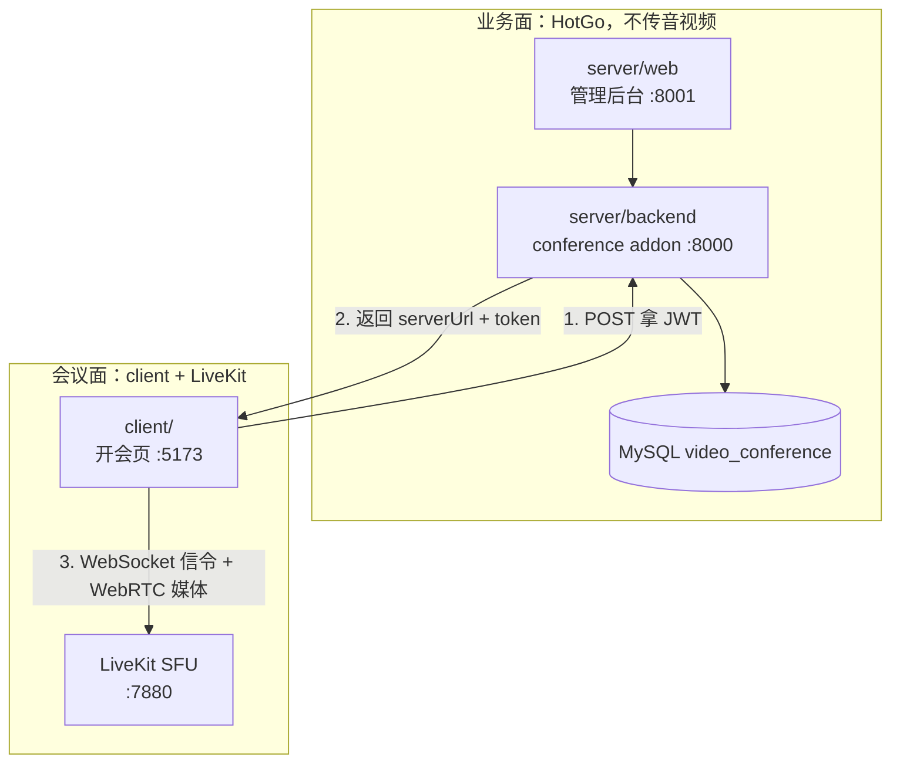
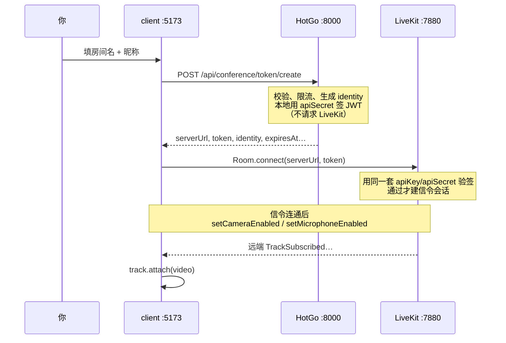

# 阶段 1～2：你要亲自懂的东西

> 配套 [[学习和实现路线]]。代码可以交给 Agent；**出了问题要能分层判断**，并能把下面概念讲给别人听。  
> 写法：先建立心智模型 → 对照本仓库真实路径 → 用自测题验收自己。

---

## 0. 一张总图（先钉死边界）



记住三句话：

1. **HotGo 不转发摄像头画面**；它只做组织、权限、**签发进房票据（Token）**。
2. **画面和声音只走 LiveKit**；浏览器通过 `livekit-client` 直连 LiveKit。
3. **Token ≠ 房间密码**；Token =「这个人、进哪个房、能干什么、多久过期」的短期授权。

出问题先问自己：是 **拿不到 Token（业务面）**，还是 **Token 有了但连不上房 / 没画面（媒体面）**？

---

## 1. 阶段 1：媒体面心智模型

### 1.1 一路画面怎么走？SFU 在哪？

你开摄像头 → 对方看到你，中间大致是：

| 步骤 | 发生什么 | 谁负责 |
| --- | --- | --- |
| A | 浏览器向本机要摄像头流（`getUserMedia`） | 浏览器 / 系统 |
| B | 通过 **信令** 告诉 LiveKit：「我要进房、我要发视频轨」 | WebSocket（常走 7880） |
| C | 通过 **WebRTC** 把编码后的音视频包发到 LiveKit | UDP 为主（7882 等） |
| D | LiveKit **不混流成一路大视频**，而是按订阅关系 **转发** 各人的轨 | **SFU 就在这里** |
| E | 对方浏览器收到你的轨，挂到 `<video>` 上播放 | `track.attach(videoEl)` |

**SFU（Selective Forwarding Unit）**：选择性转发单元。  
对比：

- **Mesh**：每人直连每人，人一多连接爆炸 → 不适合会议。
- **MCU**：服务器把所有人合成一路再下发 → 服务器很重，延迟高。
- **SFU（LiveKit）**：服务器主要做「谁订了谁的轨就转给谁」→ 私有化会议的主流选择。

所以：**你的像素不会经过 HotGo**；HotGo 只在进房前插手一次（发 Token）。

### 1.2 Room / Participant / Track

用开会类比：

| 概念 | 像什么 | 本项目里你会看到 |
| --- | --- | --- |
| **Room** | 会议室本身（名字是字符串，如 `demo`） | Token 里的 `room`；URL `/room/demo` |
| **Participant** | 会议室里的一个人 | 有唯一 **identity**；显示名常是 nickname |
| **Track** | 这个人发出的一路媒体 | 麦克风、摄像头、屏幕共享 = **三种不同的 Track** |

要点：

- **一个人可以同时有多条 Track**（麦 + 摄像头 + 可选屏幕）。
- **关摄像头 ≠ 离开房间**：人还在，只是某条视频 Track 停了或 mute 了。
- **房间名不存在时**：LiveKit 默认「第一个人进房就创建」——阶段 2 我们故意不建会议业务表，就是依赖这个。

### 1.3 Token 里到底有什么？为什么前端不能自己签？

一张 LiveKit Token 本质是 **JWT**，核心载荷可以想成：

```text
apiKey（谁签的） + identity（我是谁）
+ room（进哪个房） + grant（能干什么）
+ exp（多久作废）
```

本仓库服务端签发时（`conference` addon）大致授予：

- `roomJoin`：允许进指定房间  
- `canPublish`：可发布音视频  
- `canSubscribe`：可订阅别人  
- `canPublishData`：可走数据通道（以后举手、信令扩展用）

**为什么 Secret 绝不能进前端？**

- Secret 能签发「任意房间、任意权限」的 Token。  
- 前端代码用户都能看到 → 等于把大楼总钥匙贴在玻璃门上。  
- 正确分工：**浏览器只拿已经签好的短 Token**；**只有服务端持有 `apiKey/apiSecret`**（本机在被 gitignore 的 `config.yaml`）。

**identity vs nickname：**

| | identity | nickname |
| --- | --- | --- |
| 作用 | 房间内技术身份，**必须唯一** | 给人看的名字 |
| 谁生成 | **必须服务端生成**（我们用 `u_<随机>`） | 用户自己填 |
| 撞车后果 | 同 identity 后进会把先进的人踢掉 | 可以重名，不互踢 |

阶段 1 用 `lk token create --identity zhangsan` 时，你自己保证两个窗口 identity 不同；阶段 2 改成服务端自动生成，同昵称也不会互踢。

### 1.4 端口：7880 / 7881 / UDP 各干什么？

| 端口 | 典型用途（本机 `--dev` / 我们的 Docker 配置） |
| --- | --- |
| **7880** | **信令**：WebSocket / HTTP。进房、发布/订阅协商、状态同步。`ws://127.0.0.1:7880` |
| **7881** | WebRTC 的 **TCP 回退**（UDP 被墙/受限时） |
| **7882/UDP**（或生产一大段 UDP） | **真正的音视频包**走这里 |

生产环境常开 **一大段 UDP（如 50000–60000）**，是因为：

- 每个 PeerConnection / 每路媒体需要多个端口或端口复用策略；  
- 并发房间多时，固定单端口不够灵活；  
- SFU 要同时收很多人的上行、转给很多人的下行。

**排查口诀：**

- 连不上、立刻报 `Failed to fetch` / signal 失败 → 先查 **7880 信令**（服务没起、地址错、代理/浏览器拦了）。  
- 显示「已连接」但黑屏、几秒后断 → 更常是 **媒体面（ICE/UDP）**，不是 Token 文案错了。

### 1.5 ICE / TURN：为什么家里局域网能通？什么时候必须 TURN？

极简版：

1. 浏览器和 LiveKit 要商定「数据包往哪送」→ 交换 **ICE candidate**（候选地址）。  
2. 同一局域网、或本机 `127.0.0.1`：双方往往直接打通 → **不需要 TURN**。  
3. 双方都在复杂 NAT / 公司防火墙后，直连失败 → 需要 **TURN** 中继（流量绕第三方服务器，贵且有延迟）。

你踩过的坑（必刻）：

> Docker 里的 LiveKit 若对外宣告容器 IP `172.17.0.2`，浏览器根本连不上这个地址 → ICE failed → 看起来像「进房成功又断开」。  
> 处理：brew 原生跑，或 Docker 配 `node_ip: 127.0.0.1`（本仓库 `scripts/start-livekit.sh` 已这样做）。

**自测：纯内网开会要不要 TURN？**  
一般不要。要 TURN 的典型场景：跨公网、严格对称 NAT、只出不进的企业网。

### 1.6 阶段 1 自测题（建议口头答一遍）

1. SFU 和「服务器把所有人合成一路视频」有什么区别？
2. 两个窗口都能进 `demo`，但后进的把先进的踢了——最先怀疑什么？
3. Token 过期和 ICE 失败，页面现象可能都是「进不去/断了」，你怎么区分？
4. 为什么 `meet.livekit.io`（https）连 `ws://localhost:7880` 可以，连 `ws://192.168.x.x:7880` 常不行？

参考答案见文末附录 A。

---

## 2. 阶段 2：业务面 + 自有开会页

### 2.1 为什么拆成「HotGo 后台」和「client 开会页」？

| 目录 | 角色 | 技术 |
| --- | --- | --- |
| `server/backend` | 业务 API、插件、签 Token | Go / GoFrame / HotGo |
| `server/web` | 组织、权限、**未来会议管理** | Vue + Naive UI |
| `client/` | **真正开会的人用的界面** | Vue3 + Ant Design Vue + livekit-client |

阶段 4 要套 Tauri：壳子盖在 **`client/`** 上，所以开会 UI 不能嵌进 `server/web` 的后台壳子里，否则桌面端还要重写一遍。

HotGo 的 **addon（插件）**：会议能力放在 `addons/conference`，少改 HotGo 核心，方便以后升级上游。

### 2.2 进房完整时序（对照你点的「进入会议」）



**常见误区：签发 Token 要不要问 LiveKit？**

不要。HotGo 里用的是 LiveKit 的 **server SDK 本地算 JWT**（`auth.NewAccessToken(...).ToJWT()`），过程中 **零网络调用** LiveKit。

LiveKit 怎么知道 Token 真伪？靠 **预共享密钥**：启动 LiveKit 时配置的 `apiKey/apiSecret`，和 HotGo `config.yaml` 里写的是同一对。进房时 LiveKit **本地验签**（签名对不对、有没有过期、grant 允不允许进这个房）——类似用同一把章盖章 / 验章，不需要签发时先去「登记」。

对照本仓库：`server/backend/addons/conference/logic/sys/token.go`。

API 返回字段怎么用：

| 字段 | 谁用 | 含义 |
| --- | --- | --- |
| `serverUrl` | 客户端连 LiveKit | 如 `ws://127.0.0.1:7880`（开发期可能经 Vite 代理改写） |
| `token` | `Room.connect` 第二参数 | 短期 JWT，勿当永久登录态 |
| `room` | 路由 / 校验 | 规范化后的房间名 |
| `identity` | 调试、日志 | 服务端生成的唯一 ID |
| `nickname` | UI 显示 | 你填的名字 |
| `expiresAt` | 进房前检查 | Unix **秒**；过期要重新申请 |

### 2.3 `livekit-client` 事件模型（开会页的神经系统）

客户端核心对象是 **`Room`**（见 `client/src/composables/useLiveKitRoom.ts`）。  
你不需要背 API，但要知道 **状态从哪来**：

| 事件 / 状态 | 含义 | UI 通常怎么表现 |
| --- | --- | --- |
| `ConnectionState.Connecting` | 正在建信令 | 「连接中」 |
| `ConnectionState.Connected` | 信令已通 | 「已连接」 |
| `ConnectionState.Reconnecting` | 网络抖，在重连 | 「重连中」——拔网线自测看这个 |
| `Disconnected` | 断了 | 「已断开」 |
| `ParticipantConnected` | 有人进房 | 宫格多一个人 |
| `ParticipantDisconnected` | 有人离开 | 少一个人 |
| `TrackSubscribed` | **订到了别人的轨**（画面/声音真正可用的关键点） | 给远端挂 `<video>` / `<audio>` |
| `LocalTrackPublished` | 自己的轨发布成功 | 刷新本地预览 |

分层判断：

```text
页面报「获取凭证失败」     → HotGo / 代理 / 参数
「无法连接 LiveKit 信令」  → LiveKit 没起、URL、代理（我们踩过 Cursor 拦 :7880）
已连接但本地黑屏         → 常是 DOM 没 attach 轨（本地预览其实不依赖 SFU）
已连接、本地有画、远端无   → 更像 ICE/订阅/对方没发布
```

**本地预览为什么不依赖对方？**  
你的摄像头 Track 在本机就已经存在；`attach` 到本地 `<video>` 只是「自己看自己」。SFU 只影响 **别人能不能收到你**、**你能不能收到别人**。

### 2.4 开发期为什么 Vite 要代理 `/rtc`？

理想情况：浏览器直连 `ws://127.0.0.1:7880`。  

Cursor 内置预览等环境会拦「页面在 5173、WebSocket 却打到 7880」→ 表现为 `Failed to fetch`。  

所以开发配置里：

- Vite 把 **`/rtc` 代理到 LiveKit**；  
- `resolveLiveKitUrl` 在 DEV 下把连接地址改成 **同源** `ws://127.0.0.1:5173`。  

生产 / 正常 Chrome 直连 LiveKit 即可；这是 **环境约束**，不是 LiveKit 协议变了。

### 2.5 进程与端口清单（启动全部时）

| 进程 | 配置名 | 端口 | 职责 |
| --- | --- | --- | --- |
| LiveKit | LiveKit | 7880… | SFU |
| HotGo API | HotGo API (Air) | 8000 | 签 Token、业务 |
| HotGo Web | HotGo Web | 8001 | 管理后台（阶段 2 不嵌开会页） |
| 开会客户端 | Client (Vite) | 5173 | 进房 UI |

数据库：`video_conference`（独立库，别碰别的项目的 `hotgo` 库）。

### 2.6 阶段 2 自测题

1. 用户只改前端，把 `apiSecret` 写进浏览器去自己签 Token——产品上会怎样？架构上我们怎么防？  
2. `TrackSubscribed` 和 `ParticipantConnected` 哪个更接近「对方画面该出现了」？  
3. 昵称都叫「张三」的两个人进同一房间，会不会互踢？取决于什么？  
4. 拔网线 10 秒再插：你期望看到什么状态？恢复后要不要重新点「进入会议」？

参考答案见附录 B。

---

## 3. 建议你怎么「学懂」（而不是再读一遍代码）

按这个顺序练，每条都用嘴巴讲出来：

1. **只开 LiveKit**，用 `lk token create` + meet.livekit.io 进一次房——只理解媒体面。  
2. **看一眼** Token API 的响应 JSON（curl 或浏览器 Network），指出哪个字段进 `connect`。  
3. **双开** `client`：同房间不同昵称，在 Network 里确认两次 `identity` 不同。  
4. **故意弄坏**：停 LiveKit → 看报错；停 HotGo → 看报错；关摄像头权限 → 看报错。  
5. **对照日志**：LiveKit 日志里找进房、发布轨；HotGo 日志里找 `/api/conference/token/create`。

目标不是背源码，而是：

> 「壳崩了还是媒体挂了？Token 错了还是 ICE 错了？本地没画面还是远端没画面？」

---

## 附录 A：阶段 1 参考答案

1. SFU 转发各路轨；MCU 才是服务器合成一路。LiveKit 是 SFU。  
2. 两个窗口用了同一个 **identity**。  
3. Token 问题：信令阶段就拒（鉴权失败）；ICE 问题：常能短暂 Connected 再断，或已连接无媒体。看 LiveKit 日志 / `chrome://webrtc-internals`。  
4. 浏览器混合内容：https 页默认禁 ws://；但对 **localhost** 有豁免，对局域网 IP 没有。

## 附录 B：阶段 2 参考答案

1. 任何人都能签发进任意房间的票 → 会议室被劫持。防法：Secret 只在服务端；前端只拿短 JWT。  
2. **`TrackSubscribed`**（人进了但轨还没订到时，可能只有占位）。  
3. **不会**因昵称互踢；互踢只看 **identity**。我们服务端每次随机 identity。  
4. 应出现重连中 / 已断开一类状态；LiveKit 客户端常会自动重连。若 Token 仍有效且 Room 还在，往往不用重新填表；若会话丢了或 Token 过期，要重新走「进入会议」。以你实际联调现象为准，能解释即可。

---

## 和本仓库的索引

| 想看实物 | 去哪 |
| --- | --- |
| 签 Token | `server/backend/addons/conference/logic/sys/token.go` |
| Token HTTP 入口 | `POST /api/conference/token/create` |
| 开会页进房 / 挂轨 | `client/src/views/JoinView.vue`、`RoomView.vue`、`composables/useLiveKitRoom.ts` |
| 挂载到 video 的时机 | `client/src/components/MediaTrack.vue` |
| LiveKit 本地启动 | `scripts/start-livekit.sh`、调试配置「启动全部」 |
| 总路线与进度 | [[学习和实现路线]] |
